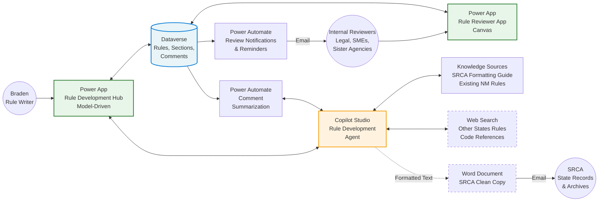

```mermaid
graph LR
    %% Human Actors
    Braden((Braden<br/>Rule Writer))
    Reviewers((Internal Reviewers<br/>Legal, SMEs,<br/>Sister Agencies))
    SRCA((SRCA<br/>State Records<br/>& Archives))

    %% Core Apps
    ModelApp[Power App<br/>Rule Development Hub<br/>Model-Driven]
    CanvasApp[Power App<br/>Rule Reviewer App<br/>Canvas]

    %% Data
    Dataverse[(Dataverse<br/>Rules, Sections,<br/>Comments)]

    %% AI
    Agent[Copilot Studio<br/>Rule Development<br/>Agent]
    Knowledge[Knowledge Sources<br/>SRCA Formatting Guide<br/>Existing NM Rules]

    %% Automation
    PA_Notify[Power Automate<br/>Review Notifications<br/>& Reminders]
    PA_Summarize[Power Automate<br/>Comment<br/>Summarization]

    %% External
    Web[Web Search<br/>Other States Rules<br/>Code References]
    WordDoc[Word Document<br/>SRCA Clean Copy]

    %% Connections - Braden's workflow
    Braden --> ModelApp
    ModelApp <--> Dataverse
    ModelApp <--> Agent
    Agent <--> Knowledge
    Agent <--> Web
    Agent -.->|Formatted Text| WordDoc

    %% Connections - Reviewer workflow
    Reviewers --> CanvasApp
    CanvasApp <--> Dataverse

    %% Connections - Automation
    Dataverse --> PA_Notify
    PA_Notify -->|Email| Reviewers
    Dataverse --> PA_Summarize
    PA_Summarize <--> Agent

    %% Connections - Final submission
    WordDoc -->|Email| SRCA

    %% Styling
    style Dataverse fill:#e8f4f8,stroke:#0078d4,stroke-width:2px
    style Agent fill:#fff3e0,stroke:#f59e0b,stroke-width:2px
    style ModelApp fill:#e8f5e9,stroke:#2e7d32,stroke-width:2px
    style CanvasApp fill:#e8f5e9,stroke:#2e7d32,stroke-width:2px
    style WordDoc stroke-dasharray: 5 5
    style Web stroke-dasharray: 5 5
```
